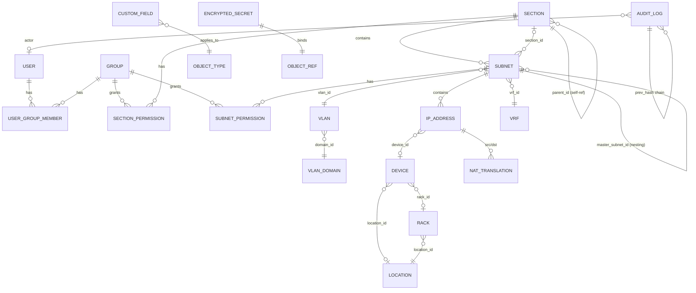

# jt-ipam Core Data Model

> 繁體中文版：[DATA_MODEL.md](DATA_MODEL.md)

> Phase 1 scope: Section / Subnet / IP Address / VLAN / VRF / Device / Rack / Location / NAT / User / Group / AuditLog / EncryptedSecret / CustomField.
>
> Backend: SQLAlchemy 2.0 + PostgreSQL 16, using native `inet` / `cidr` / `macaddr` / `jsonb` types.

---

## 1. ER diagram (core)



---

## 2. Phase 1 tables

### 2.1 `users`
| Column | Type | Notes |
|------|------|------|
| id | UUID | PK |
| username | citext UNIQUE | case-insensitive unique |
| email | citext UNIQUE | |
| display_name | text | |
| password_hash | text | argon2id; NULL for external auth (LDAP/OIDC) |
| auth_provider | text | local / ldap / radius / saml / oidc |
| external_subject | text | OIDC sub / SAML NameID / LDAP DN |
| is_active | bool | |
| is_admin | bool | superuser |
| totp_secret_enc | bytea | encrypted TOTP secret (NULL = not enabled) |
| failed_login_count | int | |
| locked_until | timestamptz | NULL or unlock time |
| last_login_at | timestamptz | |
| last_login_ip | inet | |
| created_at | timestamptz | |
| updated_at | timestamptz | |

> A02: `password_hash` and `totp_secret_enc` are always encrypted. `totp_secret_enc` is encrypted by the `EncryptedSecret` helper.
> A07: `failed_login_count` / `locked_until` drive account lockout.

### 2.2 `groups`
| Column | Type | Notes |
|------|------|------|
| id | UUID | PK |
| name | citext UNIQUE | |
| description | text | |
| is_builtin | bool | e.g. admin / readonly built-in groups |

### 2.3 `user_group_members`
| Column | Type | Notes |
|---|---|---|
| user_id | UUID FK | |
| group_id | UUID FK | |
| (PK: user_id, group_id) | | |

### 2.4 `sections`
| Column | Type | Notes |
|------|------|------|
| id | UUID | PK |
| name | text | |
| description | text | |
| parent_id | UUID FK sections.id | nesting |
| strict_mode | bool | phpIPAM-consistent |
| display_order | int | |
| created_at / updated_at | timestamptz | |

INDEX: (parent_id), (name)

### 2.5 `vlan_domains`
| Column | Type | Notes |
|---|---|---|
| id | UUID | |
| name | citext UNIQUE | |
| description | text | |

### 2.6 `vlans`
| Column | Type | Notes |
|------|------|------|
| id | UUID | PK |
| domain_id | UUID FK | |
| number | int | 1–4094 |
| name | text | |
| description | text | |
| (UNIQUE: domain_id, number) | | |

CHECK: number BETWEEN 1 AND 4094

### 2.7 `vrfs`
| Column | Type | Notes |
|------|------|------|
| id | UUID | |
| name | text UNIQUE | |
| rd | text | Route Distinguisher (e.g. 65000:100) |
| description | text | |
| allow_overlap | bool | whether IP overlap is allowed (default true) |

### 2.8 `subnets`
| Column | Type | Notes |
|------|------|------|
| id | UUID | PK |
| section_id | UUID FK | |
| master_subnet_id | UUID FK subnets.id | nesting; NULL = top-level |
| cidr | cidr | native PostgreSQL type |
| description | text | |
| vlan_id | UUID FK | |
| vrf_id | UUID FK | |
| is_pool | bool | Show as Folder |
| is_full | bool | Mark as Used |
| scan_enabled | bool | |
| scan_method | text[] | ['icmp','snmp','arp','nmap'] |
| threshold_pct | int | utilization threshold alert |
| auto_dns | bool | Phase 2 |
| custom_fields | jsonb | |
| created_at / updated_at | timestamptz | |

EXCLUDE constraint (no overlapping cidr within the same vrf, unless VRF.allow_overlap=true):

```sql
EXCLUDE USING gist (
    vrf_id WITH =,
    cidr inet_ops WITH &&
) WHERE (vrf_id IS NOT NULL) AND ...;
```

INDEX: (section_id), (master_subnet_id), GIST(cidr)

### 2.9 `ip_addresses`
| Column | Type | Notes |
|------|------|------|
| id | UUID | PK |
| subnet_id | UUID FK | |
| ip | inet | host address |
| hostname | text | |
| description | text | |
| state | text | active / reserved / offline / dhcp (phpIPAM-aligned) |
| mac | macaddr | |
| owner | text | |
| device_id | UUID FK devices.id | |
| switch_port | text | manual; Phase 2 auto-derived from LibreNMS |
| exclude_from_ping | bool | |
| ptr_ignore | bool | |
| note | text | |
| custom_fields | jsonb | |
| discovery_source | text | manual / scanner / librenms / dns / proxmox / opnsense |
| last_seen_scanner | timestamptz | |
| last_seen_librenms | timestamptz | |
| last_seen_dns | timestamptz | |
| effective_status | text | online / offline / unknown (computed in Phase 2) |
| created_at / updated_at | timestamptz | |

UNIQUE (subnet_id, ip)
INDEX: GIST(ip), (hostname trgm), (mac)

### 2.10 `locations`
| Column | Type | Notes |
|---|---|---|
| id | UUID | |
| name | text | |
| address | text | |
| latitude | numeric(10,7) | |
| longitude | numeric(10,7) | |
| description | text | |

### 2.11 `racks`
| Column | Type | Notes |
|---|---|---|
| id | UUID | |
| location_id | UUID FK | |
| name | text | |
| u_height | int | default 42 |
| description | text | |

### 2.12 `devices`
| Column | Type | Notes |
|---|---|---|
| id | UUID | |
| name | text | |
| primary_ip_id | UUID FK ip_addresses.id | |
| type | text | server / switch / router / firewall / ap / other |
| vendor | text | |
| model | text | |
| serial | text | |
| location_id | UUID FK | |
| rack_id | UUID FK | |
| u_position | int | |
| u_size | int | |
| description | text | |
| custom_fields | jsonb | |

### 2.13 `nat_translations`
The three phpIPAM NAT kinds:

| Column | Type | Notes |
|---|---|---|
| id | UUID | |
| name | text | |
| type | text | one_to_one / many_to_one / port_forward |
| src_ip_id | UUID FK | |
| dst_ip_id | UUID FK | |
| src_port | int | nullable |
| dst_port | int | nullable |
| protocol | text | tcp/udp/any |
| device_id | UUID FK | which firewall |
| description | text | |

### 2.14 `audit_logs` (A08 / A09)
| Column | Type | Notes |
|---|---|---|
| id | bigint | PK (monotonic) |
| ts | timestamptz | |
| actor_user_id | UUID FK | NULL = system |
| actor_ip | inet | |
| actor_user_agent | text | |
| object_type | text | section / subnet / ip / device / ... |
| object_id | UUID | |
| action | text | create / update / delete / login / token_create / ... |
| diff | jsonb | before/after, sensitive fields redacted |
| request_id | uuid | matching trace ID |
| prev_hash | bytea | previous row's hash |
| this_hash | bytea | sha256(prev_hash \|\| ts \|\| actor \|\| object \|\| action \|\| diff) |

INDEX: (object_type, object_id), (actor_user_id), (ts)

> The SHA-256 chain is serialized with an advisory lock on write, to avoid concurrent inserts corrupting the chain.

### 2.15 `encrypted_secrets` (A02)
| Column | Type | Notes |
|---|---|---|
| id | UUID | |
| object_type | text | dns_server / librenms_instance / api_token / totp / ... |
| object_id | UUID | |
| field | text | api_key / password / community / ... |
| ciphertext | bytea | AES-256-GCM |
| nonce | bytea | 12 bytes |
| key_id | text | KMS key version (kid) |
| created_at | timestamptz | |

UNIQUE (object_type, object_id, field, key_id)

### 2.16 `api_tokens`
| Column | Type | Notes |
|---|---|---|
| id | UUID | |
| user_id | UUID FK | |
| name | text | |
| token_hash | bytea | sha256(token) — the token itself is not stored |
| token_prefix | text(8) | for UI identification |
| scopes | text[] | endpoint patterns |
| object_filters | jsonb | section/subnet ACL |
| expires_at | timestamptz | NOT NULL |
| last_used_at | timestamptz | |
| last_used_ip | inet | |
| revoked_at | timestamptz | |

### 2.17 `custom_field_definitions`
| Column | Type | Notes |
|---|---|---|
| id | UUID | |
| object_type | text | section / subnet / ip / device |
| name | text | |
| label_zh_tw | text | |
| label_en_us | text | |
| field_type | text | text / int / float / bool / date / select / multi_select / regex |
| options | jsonb | for select |
| validation_regex | text | |
| required | bool | |
| display_order | int | |

UNIQUE (object_type, name)

### 2.18 `permissions` (generalized)
**Unified permission table for Section and Subnet**:

| Column | Type | Notes |
|---|---|---|
| id | UUID | |
| object_type | text | section / subnet |
| object_id | UUID | |
| principal_type | text | user / group |
| principal_id | UUID | |
| level | text | none / read / write / admin |

Unset by default = none (deny-by-default, A01).

### 2.19 `user_preferences`
| Column | Type | Notes |
|---|---|---|
| user_id | UUID PK | |
| locale | text | zh-TW / en-US |
| theme | text | light / dark / auto |
| timezone | text | |
| calendar | text | gregorian / minguo |
| page_size | int | |
| default_section_id | UUID | |
| dashboard_layout | jsonb | |

---

## 3. Phase 2+ tables (reserved)

- `dns_servers`, `dns_zones`, `dns_records`
- `librenms_instances`, `librenms_devices`, `arp_entries`, `fdb_entries`
- `ip_request`, `ip_request_step`
- `tags`, `taggable_object`

---

## 4. Naming and indexing conventions

- Primary key: UUIDv7 (time-ordered, PK-index friendly)
- Time columns: always `timestamptz` (stored as UTC)
- Enumerations: `text` + CHECK constraint (avoids PG enum's value-change pain)
- Full-text search: `pg_trgm` GIN index on `description`, `hostname`, `name`
- Soft delete: avoided; use `is_active` / `archived_at` as needed instead
- Concurrent updates: every mutable table has `updated_at`, paired with `If-Match` ETag to prevent lost updates

---

## 5. Migration strategy

- After Alembic auto-generate, **review manually**; never apply blindly
- Migrations are effectively **forward-only** (don't rely on downgrade) while still keeping a `downgrade()` function for dev environments
- Large-table changes are two-phased: add column + dual-write first, then switch over, finally drop the old column
- Every migration must run on staging before prod
